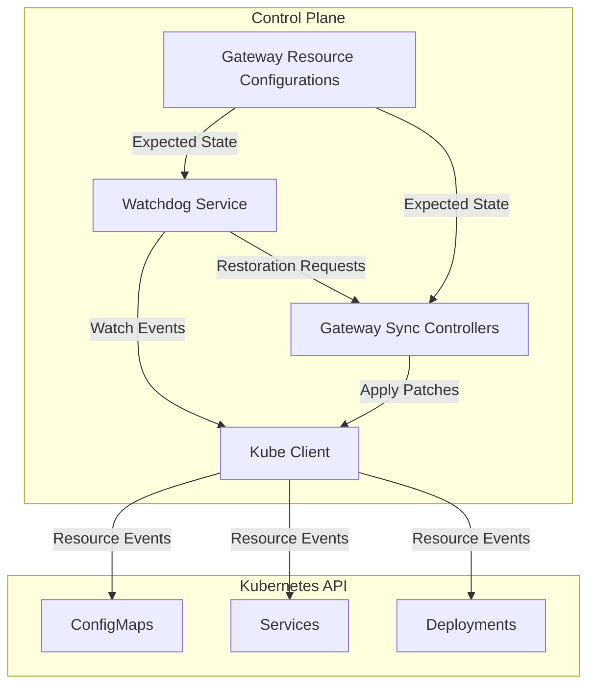

# Design Document

## Overview

The Kubernetes Resource Watchdog is a service that continuously monitors gateway-managed Kubernetes resources (ConfigMaps, Services, and Deployments) and automatically restores them to their expected state when unauthorized changes are detected. The watchdog integrates with the existing gateway synchronization system to provide real-time drift detection and correction.

The service operates as a separate controller within the control plane that uses Kubernetes watch APIs to monitor resource changes and coordinates with existing sync controllers to avoid conflicts during restoration operations.

## Architecture

### High-Level Architecture



### Component Integration

The watchdog service integrates with existing components:

- **Gateway Sync Controllers**: Coordinates restoration operations to avoid conflicts
- **Gateway Resource Configurations**: Uses as source of truth for expected resource state
- **Kubernetes Client**: Leverages existing client for API operations
- **Task Builder**: Uses existing task management system for concurrent operations

## Components and Interfaces

### Core Components

#### 1. ResourceWatchdogService

Main service that orchestrates all watchdog operations:

```rust
pub struct ResourceWatchdogService {
    options: Arc<Options>,
    maintenance_mode: Arc<AtomicBool>,
}

impl ResourceWatchdogService {
    pub fn start_all_watchers(
        &self,
        task_builder: &TaskBuilder,
        kube_client_rx: Receiver<KubeClientCell>,
        configurations_rx: Receiver<GatewayResourceConfigurations>,
    );
}
```

#### 2. ResourceWatcher<T>

Generic watcher for specific resource types:

```rust
pub struct ResourceWatcher<T> 
where 
    T: Clone + Debug + DeserializeOwned + Resource<Scope = NamespaceResourceScope>,
{
    resource_type: PhantomData<T>,
    drift_detector: DriftDetector<T>,
    restoration_coordinator: RestorationCoordinator<T>,
}

impl<T> ResourceWatcher<T> {
    pub fn start_watching(
        &self,
        task_builder: &TaskBuilder,
        kube_client_rx: Receiver<KubeClientCell>,
        configurations_rx: Receiver<GatewayResourceConfigurations>,
    );
}
```

#### 3. DriftDetector<T>

Detects configuration drift by comparing actual vs expected state:

```rust
pub struct DriftDetector<T> {
    _phantom: PhantomData<T>,
}

impl<T> DriftDetector<T> {
    pub fn detect_drift(
        &self,
        actual: &T,
        expected: &T,
    ) -> Option<ResourceDrift<T>>;
    
    pub fn is_managed_resource(&self, resource: &T) -> bool;
}
```

#### 4. RestorationCoordinator<T>

Coordinates restoration operations with existing sync controllers:

```rust
pub struct RestorationCoordinator<T> {
    _phantom: PhantomData<T>,
    retry_policy: RetryPolicy,
}

impl<T> RestorationCoordinator<T> {
    pub async fn restore_resource(
        &self,
        client: Client,
        drift: ResourceDrift<T>,
        sync_lock: Arc<Mutex<()>>,
    ) -> Result<(), RestorationError>;
}
```

#### 5. WatchdogConfiguration

Configuration management for watchdog behavior:

```rust
#[derive(Debug, Clone)]
pub struct WatchdogConfiguration {
    pub enabled: bool,
    pub maintenance_mode: bool,
    pub detection_interval: Duration,
    pub restoration_timeout: Duration,
    pub max_retry_attempts: u32,
    pub retry_backoff_base: Duration,
}
```

### Data Models

#### ResourceDrift<T>

Represents detected configuration drift:

```rust
#[derive(Debug, Clone)]
pub struct ResourceDrift<T> {
    pub resource_name: String,
    pub namespace: String,
    pub actual_resource: T,
    pub expected_resource: T,
    pub drift_type: DriftType,
    pub detected_at: DateTime<Utc>,
}

#[derive(Debug, Clone, PartialEq)]
pub enum DriftType {
    Modified,
    Deleted,
    UnexpectedCreation,
}
```

#### RestorationEvent

Audit trail for restoration operations:

```rust
#[derive(Debug, Clone)]
pub struct RestorationEvent {
    pub resource_type: String,
    pub resource_name: String,
    pub namespace: String,
    pub drift_type: DriftType,
    pub restoration_result: RestorationResult,
    pub timestamp: DateTime<Utc>,
    pub attempt_number: u32,
}

#[derive(Debug, Clone)]
pub enum RestorationResult {
    Success,
    Failed(String),
    Skipped(String),
}
```

### Interfaces

#### WatchdogEventHandler

Interface for handling watchdog events:

```rust
pub trait WatchdogEventHandler: Send + Sync {
    async fn on_drift_detected(&self, drift: ResourceDrift<DynamicObject>);
    async fn on_restoration_completed(&self, event: RestorationEvent);
    async fn on_restoration_failed(&self, event: RestorationEvent);
}
```

#### ResourceOwnershipValidator

Interface for determining resource ownership:

```rust
pub trait ResourceOwnershipValidator: Send + Sync {
    fn is_managed_by_gateway(&self, resource: &DynamicObject) -> bool;
    fn get_gateway_name(&self, resource: &DynamicObject) -> Option<String>;
}
```

## Error Handling

### Error Types

```rust
#[derive(Debug, Error)]
pub enum WatchdogError {
    #[error("Kubernetes API error: {0}")]
    KubernetesApi(#[from] kube::Error),
    
    #[error("Resource restoration failed: {0}")]
    RestorationFailed(String),
    
    #[error("Configuration error: {0}")]
    Configuration(String),
    
    #[error("Ownership validation failed: {0}")]
    OwnershipValidation(String),
    
    #[error("Sync coordination error: {0}")]
    SyncCoordination(String),
}
```

### Error Recovery Strategy

1. **Transient Errors**: Retry with exponential backoff (max 3 attempts)
2. **Permanent Errors**: Log error and continue monitoring other resources
3. **API Unavailability**: Queue restoration attempts and retry when connectivity restored
4. **Sync Conflicts**: Defer to existing sync controllers and retry later

### Retry Policy

```rust
#[derive(Debug, Clone)]
pub struct RetryPolicy {
    pub max_attempts: u32,
    pub base_delay: Duration,
    pub max_delay: Duration,
    pub backoff_multiplier: f64,
}

impl Default for RetryPolicy {
    fn default() -> Self {
        Self {
            max_attempts: 3,
            base_delay: Duration::from_secs(1),
            max_delay: Duration::from_secs(30),
            backoff_multiplier: 2.0,
        }
    }
}
```

## Testing Strategy

### Unit Tests

1. **DriftDetector Tests**:
   - Test drift detection for modified resources
   - Test drift detection for deleted resources
   - Test ownership validation logic
   - Test edge cases (malformed resources, missing labels)

2. **RestorationCoordinator Tests**:
   - Test successful restoration operations
   - Test retry logic with various failure scenarios
   - Test sync coordination mechanisms
   - Test timeout handling

3. **Configuration Tests**:
   - Test configuration parsing and validation
   - Test maintenance mode toggling
   - Test invalid configuration handling

### Integration Tests

1. **End-to-End Watchdog Tests**:
   - Create gateway resources and verify monitoring starts
   - Modify resources and verify drift detection
   - Delete resources and verify recreation
   - Test maintenance mode functionality

2. **Sync Controller Integration**:
   - Test coordination between watchdog and existing sync controllers
   - Verify no conflicts during simultaneous operations
   - Test priority handling (sync controllers take precedence)

3. **Kubernetes API Integration**:
   - Test with real Kubernetes cluster
   - Verify watch event handling
   - Test API error scenarios and recovery

### Performance Tests

1. **Scale Testing**:
   - Test with large numbers of gateway resources (100+)
   - Measure detection latency under load
   - Verify resource usage remains acceptable

2. **Stress Testing**:
   - Test rapid resource modifications
   - Test concurrent restoration operations
   - Verify system stability under stress

### Test Utilities

```rust
pub struct WatchdogTestHarness {
    pub mock_client: MockKubeClient,
    pub test_configurations: GatewayResourceConfigurations,
    pub event_collector: Arc<Mutex<Vec<RestorationEvent>>>,
}

impl WatchdogTestHarness {
    pub fn new() -> Self;
    pub fn create_test_gateway(&mut self, name: &str) -> GatewayResourceConfiguration;
    pub fn simulate_resource_modification(&mut self, resource_name: &str);
    pub fn simulate_resource_deletion(&mut self, resource_name: &str);
    pub fn verify_restoration_occurred(&self, resource_name: &str) -> bool;
}
```

## Implementation Phases

### Phase 1: Core Infrastructure
- Implement basic watchdog service structure
- Create resource watcher framework
- Implement drift detection logic
- Add basic logging and error handling

### Phase 2: Resource Monitoring
- Implement ConfigMap monitoring
- Implement Service monitoring  
- Implement Deployment monitoring
- Add ownership validation

### Phase 3: Restoration Logic
- Implement restoration coordinator
- Add retry mechanisms with exponential backoff
- Implement sync controller coordination
- Add maintenance mode support

### Phase 4: Advanced Features
- Add comprehensive audit logging
- Implement performance optimizations
- Add configuration management
- Implement advanced error recovery

### Phase 5: Testing and Validation
- Complete unit test coverage
- Implement integration tests
- Add performance benchmarks
- Validate production readiness