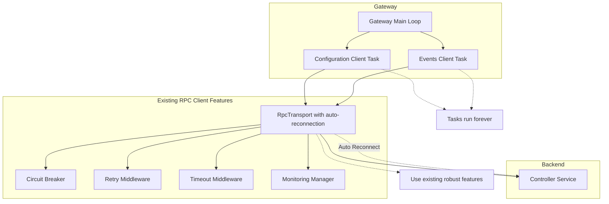

# Design Document

## Overview

This design fixes the core issue where RPC client tasks complete when the controller disconnects, causing "Gateway component completed unexpectedly" messages. The solution leverages the existing robust RPC client features to ensure tasks run indefinitely and handle reconnection transparently.

## Architecture

### Current Problem Analysis

The RPC client already has robust reconnection, circuit breakers, retries, and error handling built in. However, the client tasks are completing when they should run indefinitely. The existing `RpcTransport` has automatic reconnection, but the client tasks using it are not structured to run forever.

**Root Cause**: Client tasks complete instead of running in persistent loops that leverage the existing robust transport features.

### Solution Architecture



## Components and Interfaces

### 1. Leverage Existing RpcTransport Features

**Current State**: The `RpcTransport` already has:
- Automatic reconnection with exponential backoff
- Connection monitoring and health checks  
- Circuit breaker protection
- Retry middleware with configurable policies
- Timeout handling

**Issue**: Client tasks are not using these features properly - they complete instead of running persistently.

### 2. Fix Client Task Lifecycle

**Current Problem**: 
```rust
// In ConfigurationEventsClient or similar
pub async fn start(&mut self) -> Result<Handle, Error> {
    // Task completes when connection issues occur
    let handle = tokio::spawn(async move {
        // This completes on connection failure
        self.run().await
    });
}
```

**Solution**:
```rust
// Use existing transport resilience in persistent loop
pub async fn start(&mut self) -> Result<Handle, Error> {
    let handle = tokio::spawn(async move {
        loop {
            // Let the robust transport handle all connection issues
            match self.run_with_transport_resilience().await {
                Ok(_) => {
                    // Should rarely happen - log and continue
                    tracing::debug!("Client loop completed normally, restarting");
                }
                Err(e) if self.transport.should_retry(&e) => {
                    // Transport will handle reconnection
                    tracing::debug!("Recoverable error, transport handling: {}", e);
                    continue;
                }
                Err(e) => {
                    // Only break on truly unrecoverable errors
                    tracing::error!("Unrecoverable client error: {}", e);
                    break;
                }
            }
        }
    });
}
```

### 3. Use Existing Error Classification

The RPC client already has `ErrorClassification` trait with:
- `is_retryable()` - for retry middleware
- `should_trip_circuit_breaker()` - for circuit breaker
- `is_temporary()` - for reconnection logic

**Solution**: Use these existing methods to determine if tasks should continue running.

### 4. Leverage Existing Monitoring

The `MonitoringManager` already provides:
- Connection health monitoring
- Automatic reconnection triggers
- Status reporting

**Solution**: Use the existing monitoring to keep tasks alive during reconnection.

## Implementation Strategy

### Use Existing RPC Client Infrastructure

The RPC client already provides all necessary components:

1. **RpcTransport** - handles reconnection automatically
2. **ErrorClassification** - determines if errors are recoverable  
3. **MonitoringManager** - tracks connection health
4. **Circuit breaker, retry, timeout middleware** - handle failures gracefully

### Key Changes Required

1. **Client Task Structure**: Modify client tasks to run in persistent loops
2. **Error Handling**: Use existing `ErrorClassification` to determine task continuation
3. **Transport Integration**: Ensure tasks leverage existing transport resilience
4. **Shutdown Handling**: Only complete tasks on explicit shutdown signals

## Error Handling

### Use Existing Error Classification

The RPC client already has `ErrorClassification` trait:

```rust
// Already exists in rpc-client/src/api.rs
impl ErrorClassification for ConfigurationClientError {
    fn is_retryable(&self) -> bool { /* existing implementation */ }
    fn should_trip_circuit_breaker(&self) -> bool { /* existing implementation */ }
    fn is_temporary(&self) -> bool { /* existing implementation */ }
}
```

### Task Continuation Logic

```rust
// Use existing error classification to determine task behavior
impl ConfigurationClientError {
    pub fn should_complete_task(&self) -> bool {
        // Use existing is_temporary() method
        !self.is_temporary()
    }
}
```

### Leverage Existing Transport Features

The `RpcTransport` already handles:
- Automatic reconnection with exponential backoff
- Connection health monitoring  
- Circuit breaker integration
- Retry policies

**Solution**: Ensure client tasks use these features instead of completing.

## Testing Strategy

### Unit Tests

1. **Task Persistence Tests**
   - Verify RPC client tasks never complete on connection failures
   - Test that tasks only complete on explicit shutdown signals
   - Verify reconnection loops work correctly

2. **Error Recovery Tests**
   - Test error classification (recoverable vs unrecoverable)
   - Verify reconnection triggers for appropriate errors
   - Test backoff strategy calculations

3. **Connection State Tests**
   - Test connection state transitions
   - Verify reconnection attempt tracking
   - Test backoff delay calculations

### Integration Tests

1. **Controller Shutdown Scenarios**
   - Start gateway, shut down controller, verify no "completed unexpectedly" messages
   - Verify automatic reconnection when controller restarts
   - Test that gateway continues running throughout

2. **Network Failure Scenarios**
   - Simulate network partitions
   - Test reconnection after network recovery
   - Verify task persistence during network issues

3. **Long-Running Stability Tests**
   - Run gateway for extended periods with intermittent controller restarts
   - Verify no task completions or memory leaks
   - Test reconnection reliability over time

## Implementation Approach

### Phase 1: Fix Client Task Lifecycle
- Modify `ConfigurationEventsClient::start()` to run in persistent loop
- Update task structure to use existing transport resilience
- Ensure tasks only complete on explicit shutdown signals
- Use existing `ErrorClassification` to determine task continuation

### Phase 2: Enhance Error Handling Integration  
- Add `should_complete_task()` method using existing `is_temporary()`
- Ensure client tasks leverage existing circuit breaker and retry logic
- Update logging to use existing error severity classification
- Test with existing transport reconnection features

### Phase 3: Validation and Testing
- Test that tasks persist through controller shutdowns
- Verify no "Gateway component completed unexpectedly" messages
- Confirm automatic reconnection works without task completion
- Validate existing monitoring and health check integration

## Key Design Principles

1. **Reuse Existing Infrastructure**: Leverage all existing RPC client robust features
2. **Minimal Changes**: Only modify the inner task lifecycle loops within client tasks and transport components, not the existing transport APIs, error handling logic, or reconnection mechanisms
3. **Preserve Functionality**: Maintain all existing reconnection and resilience behavior
4. **Simple Solution**: Fix the core issue without adding complexity